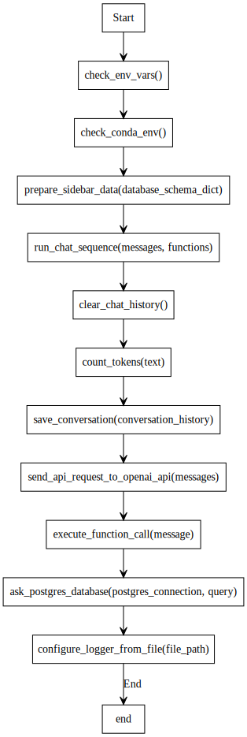

To provide a detailed explanation for each function mentioned in the application flow, we'll delve into the specifics of what each function does, the parameters it accepts, and its role within the application. This will give a clearer understanding of the application's architecture and how different components interact with each other.

    
### Detailed Function Explanations

1. **`check_env_vars()`**
   - **Purpose:** Verifies that all required environment variables for the database connection are set.
   - **Parameters:** None.
   - **Returns:** `bool` - `True` if all environment variables are set, `False` otherwise.
   - **Role:** Initial setup to ensure the application has the necessary configuration to proceed.

2. **`check_conda_env()`**
   - **Purpose:** Checks if a conda environment is currently active.
   - **Parameters:** None.
   - **Returns:** `bool` - `True` if a conda environment is active, `False` otherwise.
   - **Role:** Ensures the application is running in the correct environment, which might be necessary for certain dependencies or configurations.

3. **`prepare_sidebar_data(database_schema_dict)`**
   - **Purpose:** Prepares data for visualizing the database schema objects in the Streamlit sidebar.
   - **Parameters:** `database_schema_dict` (dict) - A dictionary containing the database schema information.
   - **Returns:** `dict` - A dictionary representing the sidebar data, organized by schema and table names.
   - **Role:** Facilitates the user interface by providing a structured view of the database schema.

4. **`run_chat_sequence(messages, functions)`**
   - **Purpose:** Runs a chat sequence with the given messages and functions, interacting with the AI model.
   - **Parameters:** `messages` (list) - A list of messages exchanged in the chat sequence.
   - `functions` (dict) - A dictionary of available functions.
   - **Returns:** `dict` - The last message in the chat history.
   - **Role:** Handles the main logic of the chat interaction, including sending messages to the AI model and processing its responses.

5. **`clear_chat_history()`**
   - **Purpose:** Clears the chat history stored in the Streamlit session state.
   - **Parameters:** None.
   - **Returns:** None.
   - **Role:** Provides a way to reset the chat history, useful for starting a new conversation.

6. **`count_tokens(text)`**
   - **Purpose:** Counts the total tokens used in a text string, useful for managing API call limits.
   - **Parameters:** `text` (str) - The input text string.
   - **Returns:** `int` - The total number of tokens used in the text string.
   - **Role:** Helps manage the token usage for API calls, ensuring compliance with API limits.

7. **`save_conversation(conversation_history, directory="conversation_history")`**
   - **Purpose:** Saves a given conversation history to a markdown file with timestamps.
   - **Parameters:** `conversation_history` (list) - The conversation history to be saved.
   - `directory` (str, optional) - The directory where the conversation history will be saved. Defaults to "conversation_history".
   - **Returns:** `str` - The file path of the saved conversation history.
   - **Role:** Provides a way to persist and review past conversations.

8. **`send_api_request_to_openai_api(messages, functions=None, function_call=None, model=AI_MODEL, openai_api_key=OPENAI_API_KEY)`**
   - **Purpose:** Sends a request to the OpenAI API's chat completions endpoint, interacting with the AI model.
   - **Parameters:** `messages` (list) - A list of message objects containing 'role' and 'content' keys.
   - `functions` (list, optional) - A list of function objects. Defaults to None.
   - `function_call` (dict, optional) - A dictionary representing the function call. Defaults to None.
   - `model` (str, optional) - The model to use for the API request. Defaults to AI_MODEL.
   - `openai_api_key` (str, optional) - The API key for the OpenAI API. Defaults to OPENAI_API_KEY.
   - **Returns:** `requests.Response` - The response object from the API request.
   - **Role:** Acts as the bridge between the application and the AI model, facilitating the exchange of messages and function calls.

9. **`execute_function_call(message)`**
   - **Purpose:** Executes a function call provided by the OpenAI API's response, such as querying the database.
   - **Parameters:** `message` (dict) - The API response message containing the function call details.
   - **Returns:** `str` - The results of the function call.
   - **Role:** Handles the execution of specific actions based on the AI model's responses, such as database queries.

10. **`ask_postgres_database(postgres_connection, query)`**
    - **Purpose:** Interacts with the Postgres database to execute a given SQL query.
    - **Parameters:** `postgres_connection` (object) - The connection object to the Postgres database.
    - `query` (str) - The SQL query to be executed.
    - **Returns:** `str` - The results of the database query.
    - **Role:** Facilitates the application's ability to query the database based on user requests or AI model responses.

11. **`configure_logger_from_file(file_path)`**
    - **Purpose:** Configures the logger based on the parameter file, setting up logging for the application.
    - **Parameters:** `file_path` (str) - The path to the configuration file for the logger.
    - **Returns:** `logger` - The configured logger object.
    - **Role:** Sets up logging for the application, ensuring that important events and errors are recorded for debugging and monitoring purposes.

This detailed explanation provides a comprehensive understanding of the functions within the application, their purposes, and how they interact with each other to facilitate the application's functionality.