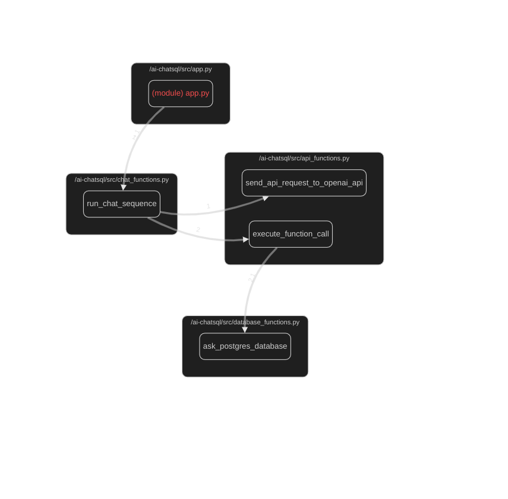

The code open in the editor, `chat_functions.py`, is part of a larger project that involves handling chat operations within a web application built using Streamlit. This module specifically focuses on managing chat sequences, clearing chat histories, counting tokens in text strings, and preparing sidebar data for visualizing database schema objects. Here's a breakdown of its components:

### Imports and Configuration

- **Imports**: The module imports several libraries and modules necessary for its operation, including `tiktoken` for token counting, `streamlit` for web app functionalities, configurations (`config`), API functions (`api_functions`), and logging setup (`logger_config`).
- **Logger Configuration**: It configures a logger named `logger` using a JSON file (`config.json`) for logging purposes throughout the module.

### Main Functions

#### `run_chat_sequence(messages, functions)`
- This function orchestrates a chat sequence by taking a list of messages and a dictionary of available functions as inputs.
- It initializes the chat history if it doesn't exist and then sends the messages to an external API (presumably an AI model) to generate responses.
- Responses are processed, and additional logic is applied based on whether the response requires executing a function call.
- The function ensures that the chat history is correctly maintained and returned the last message in the chat history.

#### `clear_chat_history()`
- This function clears the chat history stored in the Streamlit session state by deleting specific keys from `st.session_state`.

#### `count_tokens(text)`
- Counts the total number of tokens used in a given text string using the `tiktoken` library and the specified AI model configuration.

#### `prepare_sidebar_data(database_schema_dict)`
- Prepares data for visualizing database schema objects in the sidebar of the web application. It organizes the data by schema and table names.

### Additional Notes

- The module demonstrates the use of Streamlit's session state management for maintaining chat history across user interactions.
- It showcases integration with an external API for generating chat responses and executing function calls based on those responses.
- The use of logging throughout the module aids in debugging and monitoring the application's behavior.

Overall, this module plays a crucial role in enabling interactive chat functionalities within a Streamlit web application, leveraging AI models for generating responses and providing a structured approach to managing chat histories and sidebars for database visualization.